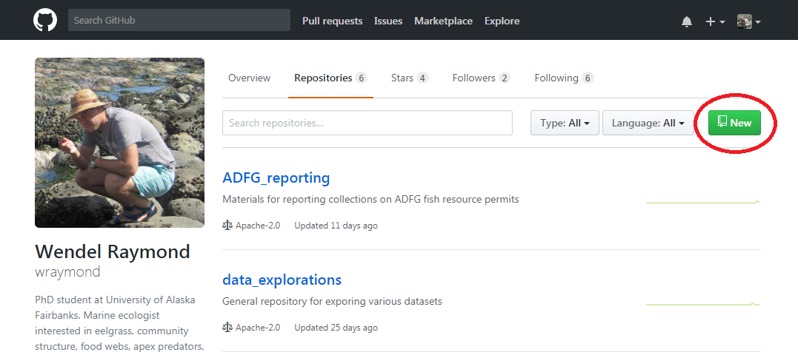
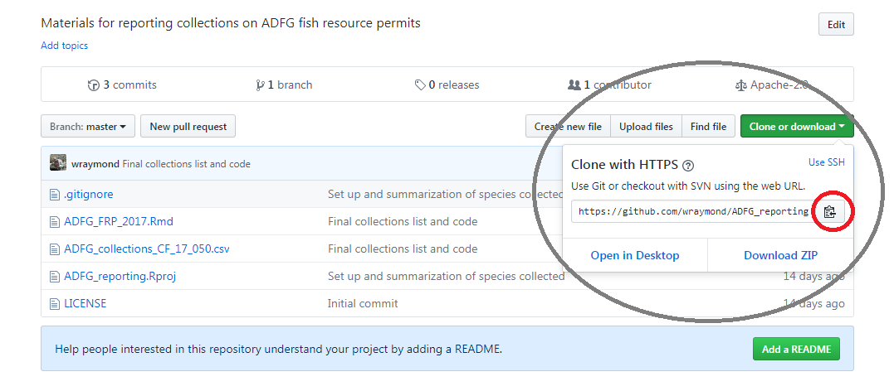
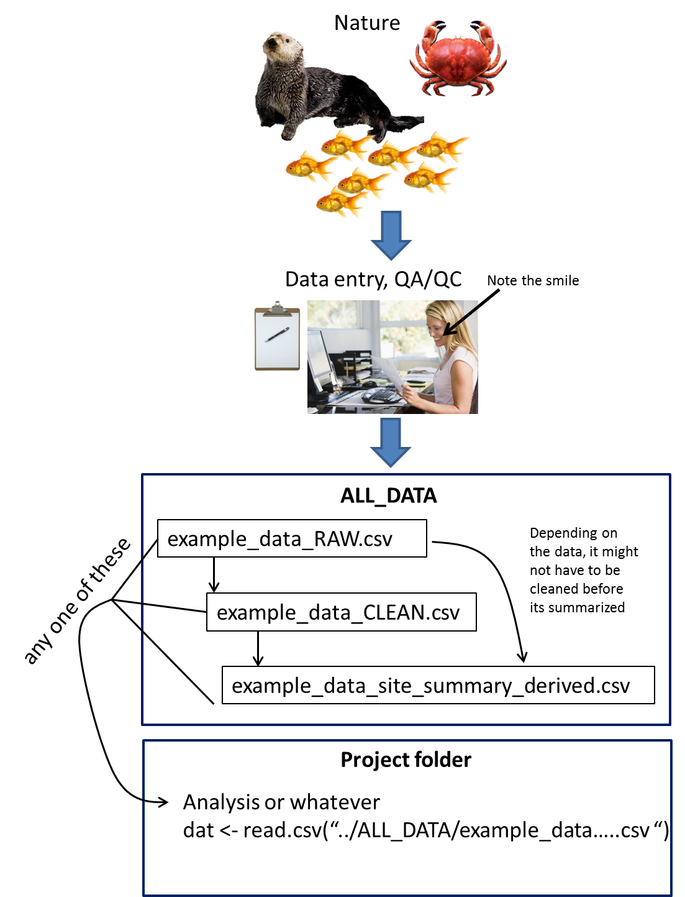

# APECS, RStudio, GitHub, Rmarkdown and you!
Thats right you! Here we will provide the steps and resources to get integrated with R Studio, R markdown and GitHub. We promise its not that bad.

## But why though?


There are two major reasons.

1. GitHub allows for tracking the changes to code and content across many people. This makes editing, contributing, and reverting easy. GitHub also provides interfaces that make sharing content way cleaner than tones of emails.
2. The overlords have spoken and you have no choice.

## Outline
1. Getting Started/R Studio /git /GitHub
2. Repositories
3. APECS-ak repository
4. Best practices
5. GitHub vocabulary
6. Resources

Depending on how long it takes to get through all this and what everyones interest is we would spend some time talking about R Markdown, dplyr, tidyr, and ggplot. However, the primary goal is to get you comfortable with GitHub.

## Getting started
We have borrowed many of the steps and techniques from the [SASAP training](https://nceas.github.io/sasap-training/materials/reproducible-analysis-in-r/index.html) that Tiff and I attended. We encourage you to use their site as an additional resource.

## RStudio and Git/GitHub set up
1. If you do not have R Studio already, [download](https://www.rstudio.com/products/rstudio/download/) it.

2. If you have R Studio make sure that you have the most recent version.
```{r rstudio version, eval = FALSE}
RStudio.Version()
```
If the output of this does not say 1.1.383, you should update your R Studio. Do this by selecting Help -> Check for Updates and follow the prompts.

3. There are some specific packages that you will need. Follow this code.
```{r packages, eval = FALSE}
packages <- c("dataone", "datapack", "devtools", "dplyr", "DT", "EML", "ggplot2", "ggpmisc", "kableExtra", "leaflet", "readxl", "tidyr")

for (package in packages) { 
  if (!(package %in% installed.packages())) { 
    install.packages(package) 
  } 
}

rm(packages) #remove variables from workspace
```

4. Setting up git and GitHub
  + Download [git](https://git-scm.com/downloads). This is good time to note that git and GitHub are different things. git is version control software and GitHub is a web interface for managing your git.
  + If you don't have one already make a [GitHub](https://github.com/) account. Remember your username and password!
  + Open R Studio and go to the Terminal tab (should be next to the Console tab). In the terminal you will set the global options for your git
```{r, eval = FALSE}
git config --global user.name "Your Name"
git config --global user.email "yourEmail@emaildomain.com"
git config --global --list
```

Hurray you did it! now we can move on to talking about repositories and the mechanics of GitHub

## Repositories and all that
Repositories are where things are stored on GitHub. You can think of them as folders, but special folders that live on your computer and on GitHub, and are also version controlled. This orientation is a repository of the APECS-ak organization. There is also the APECS-master repository that has everything in it. We will come back to this later.

We will also go over what it means to commit, push and pull.

### Practice
First lets make a practice repository on your own GitHub account **NOT** in the APECS-ak account just yet. There are multiple ways to do this but we will show you what we think in the easiest. There are steps for doing it in other ways on the SASAP training site.

1. Go to your GitHub account and click repositories.
2. In the upper right click "new" and follow the instructions.


3. Once you have created the repository you can click the clone/download button. Copy the URL looking thing


4. Now open R Studio and create a new project. When promoted select the version control option. Paste that stuff you copied from GitHub and fill in the other fields.
5. Hurray you have now cloned your repository. It now exists on your local machine and on GitHub.

Lets do some work now. Create a new R script or R markdown from this new repository. Make up some code. Now you can save it to you local machine but we also want to send it up to GitHub too. How do you do that?

1. In the upper right panel of your R Studio window there is a tab labeled Git, click it. You will see the new R script you made and maybe some other stuff. 
2. Check the little boxes next to the items, this is called staging.
3. Click the commit button. This opens a window where you can see the changes you made form the previous version. 
4. Fill in the commit message box. Be brief but descriptive. Click commit.
5. Now to get you in the practice click pull. This pulls down the most recent version of the repository from GitHub. In this example is does not really matter because you are the only one working in your repository but that might not be the case with APECS. If you push without having the most recent version on your machine you set us up for having a merge conflict. Which is not fun.
6. Now click push.
7. Go back to your repository in your browser and you will see that new file you created. Hurray!

### Cloneing the APECS-master repository
Follow the same steps as above but the repository already exists, so you can jump to step 3. Now is a good time to take a moment to think about where on your machine you want this folder to sit. There is a lot of stuff in the repository so it might take some time to download.

## Whats is in APECS-master anyway?
The idea is that everything is in here. That way anyone can access data or code at any time. Content is broken down in to folders that roughly correspond to the different working groups of APECS. Don't see a folder corresponding to a project you are working on? No worries you can create one. Within a projects folder you will find code for doing various things related to that data. 

The most important folder is the ALL_DATA folder. This is where all the data goes, whether it is RAW or derived. What does that mean? We are calling RAW data .csv files that nothing has been done to other than be entered and quality controlled. These files should not be edited, unless there is a very very very good reason and you tell Tiff about it. You may be asking, "what if my raw data has weird records in it that I need to fix before analysis?", no worries you can write code to make those changes and make a new file called data_CLEAN.csv. Now you may be thinking "but my raw data is not really the form I want it in for my analysis, then what?", no worries again, you can write code to summarize, massage, whatever to your raw data and save it as data_description_derived.csv. This is a great segway to talk about best practices. 

## Best Practices
Lets talk about best practices. These are a combination of best practices of reproducible science and "rules" that we have come up for the APECS project.

### Workflow
First lets start with the general workflow that we would like you to follow.

When starting to work on anything in the APECS-master repository
1. Pull
2. do your work
3. Save to your machine
4. Commit
5. Pull
6. Review any changes/merges etc
7. Push

Lets go over how things work on the data end of things. This is really important. It will make everyone's life easier in the long run. Take a look at the schematic below.



### Workspace
As we have seen, creating a or cloning a repository makes a R Project, and in the case of the APECS repository there are many R projects scattered in folders etc. It is important to work in the project appropriate to what you are working on. Why? this helps assign commits to the propper place. What is confusing is that you can load and R or Rmd file from anywhere into any project. That is fine if you want to refrence the code but do your best to be in the project that the primary code that you are working on is housed. You can easily change the project you are working in by selecting the .Rproj file that you want from the files tab in RStudio or from the project drop down in upper right corner.

All that said we should add some detail to the workflow steps above. Especially step 2. After pulling you should check what project you are in, and change if necessary. Then do your work.

Alright great... but when should I commit? Great question! There is no solid answer for this and it depends on what you are doing but in general you should commit and push when you have made substantial changes to what you are working on. For example Wendel may be working in R all day. First he needs to write a bunch on analysis code. This takes him a while. During his work time he **saves to his machine** a few times. When he finishes and is ready to work on code for this orientation he will **first commit and push** his work on the analysis code. Then he **will switch projects** and start working on the orientation code and repeat his logic...

### Naming convention
**Data:** By now you may have noticed that the files in the ALL_DATA folder have a similar naming convention. For clarity we would like we preserve that as much as possible. As we mentioned above the basic formula works like this: 

data_description_derived.csv

text elements should be separated by and underscore "_". For the most part files should end with either "_RAW", "_CLEAN", or "_derived". However there are some exceptions. For example the fish length-weight conversion data is in progress so it ends with the date it was last edited. In general we want to avoid putting in progress data in the folder. The fish l-w conversion is a bit of an exception because we are building the data while using it at the same time.

**Code:** You may also have noticed that .R and .Rmd files have a similar naming convention as well. The rules are not quite as strict here but use underscores and be logical. If there are scripts that are related they should have a related name. For example "Eelgrass_community_structure_analyses.Rmd" is where all the complicated long for model code is and "Eelgrass_community_structure_analyses_summaries.Rmd" is the simplified version that is nice to share with others. A more simple example is "Tiff_explore_seds.Rmd". In the seagrass group we had a little task to explore different elements of the data and report back. the key is to be descriptive by succinct. "Wendel_models_3.Rmd" is **not** a good name. 

## GitHub Vocabulary
GitHub has a complete list [here](https://help.github.com/articles/github-glossary/) but here are some key ones beyond what we have talked about above, which we hope you at least intuitively understand now.

**Branch:**A branch is a parallel version of a repository. It is contained within the repository, but does not affect the primary or master branch allowing you to work freely without disrupting the "live" version. When you've made the changes you want to make, you can merge your branch back into the master branch to publish your changes.

**Fork:**A fork is a personal copy of another user's repository that lives on your account. Forks allow you to freely make changes to a project without affecting the original. Forks remain attached to the original, allowing you to submit a pull request to the original's author to update with your changes. You can also keep your fork up to date by pulling in updates from the original.

**Merge:**Merging takes the changes from one branch (in the same repository or from a fork), and applies them into another. This often happens as a pull request (which can be thought of as a request to merge), or via the command line. A merge can be done automatically via a pull request via the GitHub web interface if there are no conflicting changes, or can always be done via the command line. For more information, see "Merging a pull request."

**Organization:**Organizations are shared accounts where businesses and open-source projects can collaborate across many projects at once. Owners and administrators can manage member access to the organization's data and projects with sophisticated security and administrative features.

## Resources
Any of these topics could take up a whole day or more of discussion and practice so we will just point you in the right direction for now. If you would like formal instruction we can arrange that.

### RMarkdown
R Markdown is amazing and we highly recommend that you learn how it works. If you are even somewhat comfortable/familiar with R it is not that much of a change. The biggest benefit is that R Markdown supports a more natural way of writing your code. You can seamlessly integrate normal text with R code, links, pictures, output etc. all in one place. The second amazing thing is that it is super easy to share what you did with collaborators in a clean, clear, reproducible product. No more sting of emails with attached figures that don't have any context. Now Markdown does come with another set of vocabulary that you will have to become familiar with, but thing of it as a new R package. The more you use it the easier it will become. There are also great online resources. Like this [cheat sheet](https://www.rstudio.com/wp-content/uploads/2015/02/rmarkdown-cheatsheet.pdf).

### dplyr and tidyr
If you know about and have used these packages already you know why we think this is important. These packages greatly simplify data manipulation and summarization. See [cheat sheet](https://www.rstudio.com/wp-content/uploads/2015/02/data-wrangling-cheatsheet.pdf)

### ggplot2
The ggplot2 package makes it fairly easy to make really good looking graphics. See [cheet sheet](https://www.rstudio.com/wp-content/uploads/2015/03/ggplot2-cheatsheet.pdf)